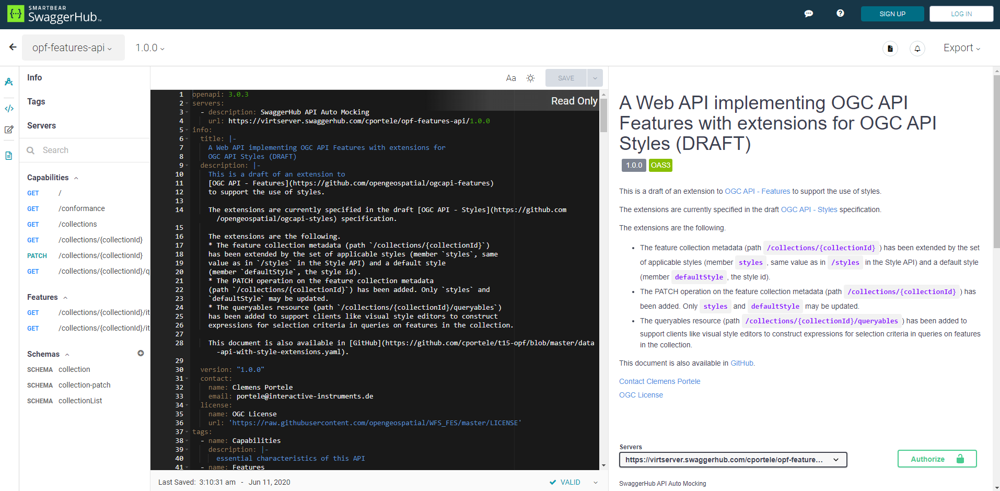
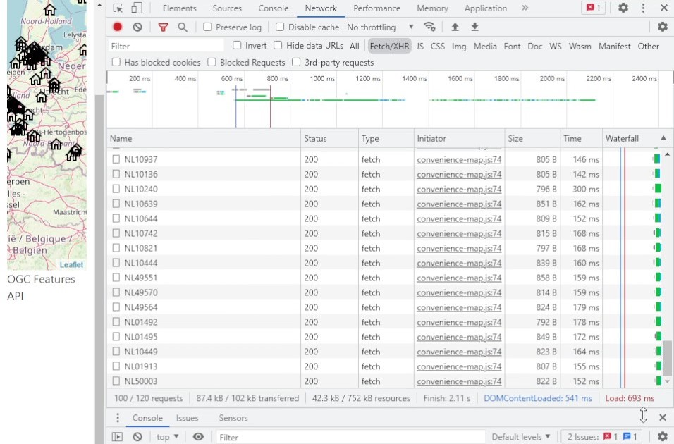
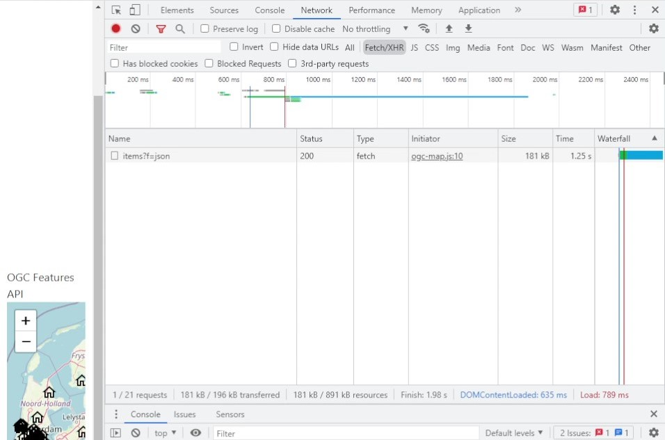
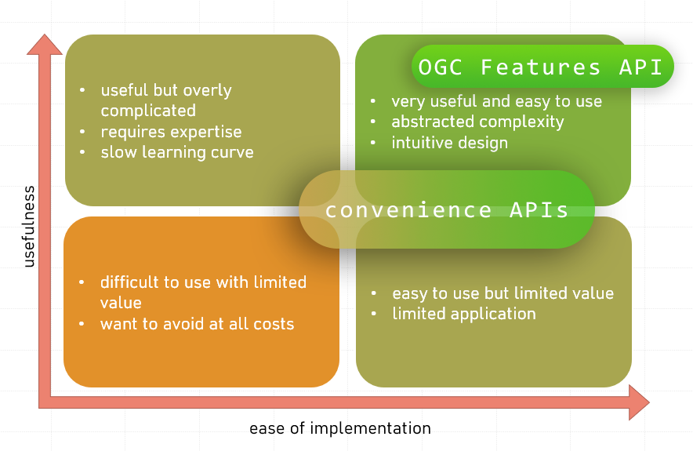

# Final Report: Evaluating Ease of Implementation (Client Side)

### Overview

When evaluating the ease of implementation there is an underlying belief that geospatial data should be accessible and
usable not only by geospatial experts but to anyone with general IT skills.

This is necessary when developing new technologies and standards with the goal of widespread adoption.

This report will look at answering the following questions:

- What are the hurdles for non-spatial data experts accessing convenience APIs and OGC Features APIs?
- What is an appropriate metric to evaluate each implementation?
- What was my experience in developing implementations and what were the differences in various client types?
- What convenience and OGC Features APIs provide over WFS 2.0/GML?

## Hurdles for Non-Spatial Experts Accessing APIs (both convenience and OGC Features API)

The hurdles related to accessing APIs tend to be issues regarding the first part of access, related to discoverability
and documentation.

Once an API is discovered and an individual gets familiar with the endpoints offered, it becomes much easier than
existing solutions. As anyone with general IT skills can understand the concept of making a request to an API.

### OGC Features API

#### Discoverability

- Currently, there are no popular commercial solutions offering geospatial data following OGC Features API. I believe
  this is important as commercial enterprises providing public facing APIs are likely to promote and invest in practical
  discoverability (i.e. advertising and SEO optimization). This also allows hobbyists and start-ups to utilize OGC
  Features APIs, which is a form of technical investment in the API standard that is currently lacking.

- The few public APIs following OGC Features API specification aren't easy to find and require either a direct link or
  prior knowledge of the resource. This alone restricts who can utilize the APIs.

#### Documentation

- Below is OGC's SwaggerHub documentation, linked from their OGC Features API webpage. The user is overloaded with
  information, creating an intimidating first impression. Not all the data is valuable and mostly redundant. Providing
  the raw documentation markdown on the documentation page itself takes away from the rendered markdown's importance, by
  repeating the same information in a less user-friendly format.

  

- The SwaggerHub documentation is also not optimized for mobile devices and renders as the desktop webpage would, not
  fitting to the mobile form factor.

- Below is OGC's ReDoc webpage, linked from their OGC Features API webpage. Although there is no information overload,
  the content seems "thrown together" with minimal effort. The titles of the sections are occasionally capitalized while
  other parts are lower case. It doesn't conform to a consistent design guideline. The menu on the side doesn't conform
  to the usual format most developers are familiar with. For example, OGC's ReDoc has "`GET` the feature collections in
  the dataset" but should be "`GET` /collections" or "`GET` Collections", this "better" menu labelling is followed in
  the SwaggerHub documentation but not the ReDoc webpage. It also raises the question of why someone would adopt the OGC
  Features API specifications when OGC themselves give the impression that little effort was put into documenting and
  presenting it (regardless of whether it's true or not).

  

### Convenience API

#### Discoverability

Convenience APIs tend better with discoverability, these are solutions offered by many organizations. When using a
search engine, convenience APIs from for-profit organizations tend to rank high and are easy to discover as they are
financially incentivized to get more users.

#### Documentation

- Below is the convenience API's documentation. It provides concise information on using the API. There are options for
  API request examples in multiple programming languages (and even subcategories among languages). This allows beginners
  to easily make their first request in their given programming language of choice. They are also using Postman, which
  is a popular tool for making, documenting, and most importantly testing APIs. Using modern tools like Postman allows
  users to easily import endpoints and test them in their desktop Postman application. This is an easy way of making
  usable and pleasant documentation but has the drawback of being tied to Postman's ecosystem. A custom (either through
  a library or from scratch) implementation mimicking Postman's documentation would be ideal but requires higher
  investment. See [Stripe](https://stripe.com/docs/api/payouts/create?lang=go) for an example of documentation that is
  similar to Postman (providing API request examples in multiple languages with a clean UI), through a custom solution.

  

- There is a wide range of variability between different convenience APIs. A more complicated application utilizing
  multiple data sources requires a user to familiarize themselves with each of the various API's endpoint structures.
  You not only have to learn about the data accessed (as you do with OGC Features API) but you also have to know how to
  access that data as each API might have a slightly different way.

## Good Metrics for Evaluating Ease of Implementation

Evaluating ease is a very subjective task when talking about any technology. There are always variables that can change
an implementers' perspective.

Some variables to consider:

- Environment: in the case of development the environment would be the development environment and/or languages used.
  Certain languages tend to be more simple while others have more specialty use-cases, resulting in complications. As an
  example, Python is a great language for beginning developers. In this case the environment tends well with OGC
  Features API as Python makes API requests simple using the `requests` package. Processing the GeoJSON response is also
  simple in the Python environment using the `json` package. Some tasks are also easier on certain operating systems
  compared to others.

- Readability: although the number of lines used when developing may seem like a good metric, having over compressed
  code can result in less readability and understanding. It's important to not only produce compressed code but also
  readable code. This is highly subjective and varies among development teams.

- Community: whether a technology is easy or difficult to use can often be determined by the surrounding community.
  Whether there are resources, open-source projects, or forums for asking questions can have a massive impact on
  newcomers who will first go to Google to search for examples/help. Consider the
  following [survey](https://insights.stackoverflow.com/survey/2020#technology-what-do-you-do-when-you-get-stuck) from
  Stack Overflow, indicating 90% of developers stuck on an issue end up visiting Stack Overflow for help.

All that considered, an objective indicator of ease of implementation is time (relative to other solutions in the
domain). A common reason many companies moved towards using technologies such as NodeJS rather than C/C++ when
developing backends is due to development time. The less time required to solve a problem also indicates its ease and
lack of frustration in using the given technology.

## My Experience in Developing Various Implementations

This section will go over my subjective experience in implementing each of the clients. The points highlighted were
extracted from notes taken throughout development with certain topics reorganized into implementation specific points
and overarching points that hold true for all client implementations.

Below is a table of all the client implementations with links to both the source code and live demos (if applicable):

| Clients                                    | Source Code                                                                                                                                 | Live Demo                                                                            |
|--------------------------------------------|---------------------------------------------------------------------------------------------------------------------------------------------|--------------------------------------------------------------------------------------|
| Geofencing + OGC Features API              | https://github.com/ahmadayubi/features-api-implementations/tree/main/standalone/ogc/geofencing                                              | https://ahmadayubi.github.io/features-api-implementations/standalone/ogc/geofencing/ |
| Travelling Sales Person + OGC Features API | https://github.com/ahmadayubi/features-api-implementations/blob/main/standalone/ogc/simulated-annealing/simulated-annealing-windmills.ipynb | Requires Jupyter Notebook                                                            |
| Geofencing + Convenience API               | https://github.com/ahmadayubi/features-api-implementations/tree/main/standalone/convenience                                                 | https://ahmadayubi.github.io/features-api-implementations/standalone/convenience/    |
| LeafletJS + OGC Features API               | https://github.com/ahmadayubi/features-api-implementations/tree/main/browser                                                                | https://ahmadayubi.github.io/features-api-implementations/browser/                   |
| LeafletJS + Convenience API                | https://github.com/ahmadayubi/features-api-implementations/tree/main/browser                                                                | https://ahmadayubi.github.io/features-api-implementations/browser/                   |
| QGIS + OGC Features API                    | https://github.com/ahmadayubi/features-api-implementations/tree/main/traditional/ogc                                                        | Requires QGIS                                                                        |
| QGIS + Convenience API                     | https://github.com/ahmadayubi/features-api-implementations/tree/main/traditional/convenience                                                | Requires QGIS                                                                        |

### Standalone Clients

The standalone client implementations try to tackle the issues of [geofencing](https://en.wikipedia.org/wiki/Geo-fence)
and the [travelling salesperson problem](https://en.wikipedia.org/wiki/Travelling_salesman_problem). There aren't many
distinguishable advantages and obstacles to the standalone clients solely because most are shared among all
implementations.

#### Advantages

- The Python community surrounding geospatial data provides a great package known
  as [OWSLib](https://github.com/geopython/OWSLib). This package handles the `GET` requests and parsing of the JSON
  responses. By removing the need for the developer to handle 'formalities', they are then free to spend more
  development time on the application which the given dataset is needed for. The package is also part
  of [OSGeo](https://www.osgeo.org/projects/owslib/), a well-known foundation, allowing implementors to feel confident
  in their package choice.

  - In terms of metrics in evaluating ease of implementation, the number of lines required in combination with human
    readability is one indicator (subjective) in ease of use. With the help of OWSLib, the number of total lines needed
    to request data from an OGC Features API compliant server can be as minimal as 3 lines (1 for importing the package,
    2 for initializing an instance and making a collection request). The following is an example of the required code:
    ```python
    from owslib.ogcapi.features import Features

    api = Features('https://apitestbed.geonovum.nl/pygeoapi')
    collection = api.collection_items('dutch_windmills')
    ```
    This not only simplifies the process but saves on development time.

- Converting from different projections is made 'easier' and more abstract thanks to libraries such
  as [Proj](https://proj.org/). This allows the developer not to worry (as much) about the complexities of projections
  and simply get the given data the way they may need. Proj4 strings are still complicated but there are many resources
  online that have an index of proj4 strings for use, such as [spatialreference.org](https://spatialreference.org/)
  which provides the proj4 string formatted already.

#### Obstacles

- The biggest obstacle in standalone implementations is in regard to rendering geospatial data
  accurately. [GDAL](https://gdal.org/) is a popular library when dealing with geospatial data but in terms of
  installation and use, it is very difficult. The installation process on Windows (Microsoft Windows 10 Home & Pro)
  requires a lot of debugging and external downloads. A developer cannot simply `pip install gdal`, they must first
  download and install the GDAL library, then on a separate web page they must download the Python bindings for their
  given system. Lastly, they need to manually set environment variables. This entire process is error-prone and can be
  frustrating to debug. The error message when installing GDAL through `pip` is also intimidating and provides little
  help. See the video below as an example:

  

- GDAL has no official bindings for JavaScript leaving cautious developers to reimplement a lot. The unofficial binding
  currently has 59 issues with the last addition to the repository being over a year ago. This lack of ongoing support
  leaves would-be implementers with a lack of confidence.

- There is no OWSlib type package/module for JavaScript. Although this is not a big issue given the 'out of box'
  compatibility JavaScript has with JSON and the ease of making the requests manually using the Fetch API thanks to the
  intuitive hierarchy of endpoints (in OGC Features and convenience APIs). Having an OWSLib package would make the
  process even easier.

- When rendering features in WGS84, there are resources online that help in the process, but these resources are not
  always consistent and finding the different formulas for different CRSs may be even more challenging. Some of the most
  helpful resources on the topic are also provided by organizations that offer siloed solutions (such as Google Maps
  Platform). Overall, the process of implementing a custom solution for rendering is extremely error-prone and requires
  a lot of development time. I believe the process can be simplified greatly by providing a package to handle rendering.
  Similar to how there are packages for rendering [3D objects](https://pypi.org/project/panda3d-viewer/).

- There are inconsistencies among packages on how to define a coordinate, whether it should be (longitude, latitude) or
  (latitude, longitude). Inconsistencies like this are some of the hardest to debug as they are not issues a compiler or
  interpreter would notify the developer of. An example of this inconsistency can be seen in the
  [Geopy](https://github.com/geopy/geopy) package, where coordinates are defined in terms of (latitude, longitude),
  inconsistent with GeoJSON coordinates (from the OGC Features API compliant server) defined in terms of (longitude,
  latitude).

### Web-based Clients

Web-based clients are those that utilize an open-source library for making web maps. The library used in both the OGC
Features and convenience API implementations is LeafletJS. The goal of the clients is to visually display time-series
data. This is achieved using charts as the data provided didn't change geographically.

#### OGC Features API

##### Positives

- GeoJSON is supported out of the box in LeafletJS, allowing a web developer to simply supply the JSON data directly or
  using a link pointing to the data (the `/items/{id}` endpoint).

- WGS84 is supported out of the box in LeafletJS, although other projections can easily be integrated using plugins such
  as [Proj4Leaflet](https://github.com/kartena/Proj4Leaflet).

##### Obstacles

- Although GeoJSON is supported out of the box, OGC Features APIs are not (directly), there is no affordance to the user
  to take advantage of all the capabilities of an OGC Features API. This can easily be integrated through a plugin.

#### Convenience API

##### Positives

- The API's `stations` endpoint conforms to GeoJSON allowing interoperability between implementations and works out of
  the box with LeafletJS.

- The API uses WGS84, allowing it to work out of the box with LeafletJS. Alternatively, the Proj4Leaflet plugin would
  have been required.

##### Obstacles

- Requires a variable degree of familiarity with JavaScript. If the API doesn't conform to GeoJSON this requires
  preprocessing of the data before it can be passed to LeafletJS. The preprocessing phase would either require the data
  be transformed to GeoJSON or be used to create Leaflet Features directly.

#### General

- Visualizing time-series data in the JavaScript environment is made easy through multiple libraries such
  as [D3.js](https://d3js.org/) and [Chart.js](https://www.chartjs.org/). Integrating these libraries is effortless and
  documentation is easy to understand (a common trait among popular JavaScript libraries).

- LeafletJS has a mature community, if a problem is faced it's likely there is a solution to it on websites such
  as [Stack Overflow](https://stackoverflow.com/). It also allows new users to gain advanced functionality through
  plugins that are simple to integrate (i.e., time series
  data [controls](https://github.com/zimmicz/Leaflet-Timeline-Control)).

- LeafletJS has packages for many JavaScript frameworks such as ReactJS. This allows web applications to take advantage
  of LeafletJS, and holds true for many other open source libraries such as LeafletJS.

### Traditional Clients

Traditional clients tend to be specialty software with the geospatial expert in mind. These are tools that allow users
with little technical skills but high specialty skills in the geospatial domain to view and process geospatial data. The
client used is [QGIS](https://www.qgis.org/en/site/).

#### OGC Features API

The overall experience with using QGIS and OGC Features API is very simple and straightforward. QGIS has a category in
the data providers section labelled OGC Features API. A user simply has to paste the URL of the API. There are also many
tutorials online on how to get started with QGIS. I have also provided such a tutorial in the implementations'
repository linked above.

The only negative is the large download size and high number of features QGIS provides, but this is not unreasonable for
its intended use case.

#### Convenience API

##### Positives

- Uses Python as the required scripting language for accessing unsupported data providers (such as convenience APIs).
  Python is a good choice as it's a beginner-friendly scripting language that many data scientists (encompassing data
  scientists working with geospatial data) are familiar with.

##### Obstacles

- No good resources on how to connect a convenience API to QGIS. This leaves users to find their own way which decreases
  the ease of implementation.

- You are required to use the built-in text editor to run Python scripts interacting with QGIS. The editor lacks
  Intellisense or Pylance (closer in function to Notepad++ than VSCode) and is very prone to crashes as shown in the
  video [here](https://user-images.githubusercontent.com/55214462/147494769-24ca9341-874e-4a2c-b4d5-5c0112456d99.mp4).
  - There is a lack of visual feedback to let the user know the script is executing as intended. Going unresponsive can
    lead to impatient developers forcefully killing the QGIS process (resulting in lost work).

- QGIS ships with its own Python executable, although this isn't uncommon it does have drawbacks:
  - May conflict with the official Python executable in the system's PATH environment variable
  - May be outdated to the current official build of Python

### Overall

The points listed in this section are general observations that hold true among all client implementations of the given
API type.

#### OGC Features API

##### Positives

- Throughout the implementations, having the ability to develop without being coupled to a specific data provider gives
  the developer a degree of freedom and confidence, knowing their code can be reused for geospatial data following the
  same standard. This is also beneficial to organizations developing client implementations. Knowing that code can be
  reused reduces development time, resulting in fewer costs.

- The API is 'self-documenting' in terms of its intuitive design. The data returned also allows users of programs such
  as Postman or Insomnia to never have to leave the environment as the data returned also provides how to make further
  requests. Illustrated
  in [this](https://user-images.githubusercontent.com/55214462/137027582-76e8a11f-31a3-4899-a1ba-4f0aa1b01e76.mp4)
  video.

- WGS84 is a good default as there are many resources available on the topic in community forums, as well as being what
  most users are familiar with.

##### Negatives/Areas of Potential Improvement

- When searching for resources related to OGC Features API, the first page of results is populated with mostly server
  side resources. There is a lack of client implementations that can be used as guides.

- Pagination is not well-defined and varies among server implementations. For example, Pygeoapi uses `startindex` while
  others use `offset` query parameter.

- `bbox` query parameter is defined in terms of lower-left to top-right. This is not consistent with what English
  readers are used to, going from top-left to bottom-right. Documentation needs to make this apparent to avoid bugs in
  implementations.

- The standards document on OGC's website offers examples using the following `../collection/.../items.json`, but this
  URL formatting doesn't work with Pygeoapi. This may not be a hard requirement from OGC Features API but being that
  it's used in examples can be misleading.

#### Convenience API

##### Positives

- Provides functionality not defined in OGC Features API, such as the ability to make a query of any location by
  providing a latitude and longitude. (Although this may be a feature offered in other API standards it's not defined in
  OGC Features API).

- The API uses JSON. Certain endpoints also use GeoJSON allowing for a level of interoperability between clients
  designed for OGC Features API. This enables code reusability and easy migration from an OGC Features API backend to
  the convenience API backend with minimal changes (and vice versa).

##### Negatives/Areas of Potential Improvement

- The API claimed to follow GeoJSON standard but failed to do so. This is an issue that would need to be manually found
  as there are no open and free to use validators of the API as a whole. The task of making sure their claimed adherence
  falls on the provider, requiring better test coverage on their end.

- During development hot-reloading is often used by developers. When making many changes this may result in many
  reloads, overloading the server. During implementation this caused a server to go down. This can be avoided by rate
  limiting API requests (and providing more performant public APIs).

- The API was designed for a given use case in mind, the fact that it's open to the public may have been a second
  thought. This is evident based on the data returned by endpoints.

- Getting the entire collection of points requires individual requests for each station (point). This results in slower
  load time and higher bandwidth. With each request made over the network, there is overhead that can be minimized
  through a more flexible API design, such as OGC Features API (for requesting station locations). See the section
  below. This also introduces the possibility of merging both convenience and OGC Features APIs, allowing both general
  and specialty use cases.

#### Load Time Comparisons

- The link at the end of this paragraph is a video of a side-by-side comparison of load time between the OGC Features
  API and convenience API web-based implementations. The comparison is not accounting for all factors (such as server
  location, response time, etc.) but illustrates the overhead in making several individual requests rather than a single
  larger request. The ratio between overhead and data is more preferable in the OGC Features API.

  [Requests video.](https://user-images.githubusercontent.com/55214462/140626143-1377b0d1-84ed-4017-bafb-b0f9ae30c966.mp4)

- Below is an image of the requests made by the convenience API implementation. It initially makes a request to get a
  list of station names. For each station a subsequent request is required to get the location data of the station. This
  results in around 100 requests made (this would be even more if a limit wasn't set in the implementation).

  

- In comparison, below is an image of the requests made by the OGC Features API implementation. This instance of the API
  didn't offer pagination, but the standard defined pagination allows for more refined requests by the web developer for
  a wide variety of use cases. The OGC Features API also allows the ability to request multiple items in a collection
  rather than limiting the user to a single feature per request.

  

#### Visual Representation of My Experience



The OGC Features API provided an easy-to-use and useful system consistently, while the convenience API had high
variability with certain aspects being very useful while others provided little value with complexity. The convenience
API also has high variability as it depends on the provider. Different providers may fall in other categories to a
higher or lower degree.

## Other Developers' Experiences with Client Implementation

The two developers whose experience was considered for this section worked alongside Research Topic #1. Although most of
their experience was with the server implementation, they had the following points on client implementation:

### Positives

- Generally easy to use
- Standards documents are well-formed and informative
- JSON is highly preferred, especially in a TypeScript/JavaScript environment

### Areas of Improvement

- Link with `rel: self` property is redundant as the system should already have an understanding of what the current
  requested URL should be.

- `crs` property in responses may be very large and become redundant with multiple API requests. A better alternative
  would be to have a new endpoint for requesting CRS data in isolation, this endpoint would also require pagination.

## What Convenience and OGC Features APIs Provide Over WFS 2.0/GML

The biggest advantage is the hierarchical endpoint structure the APIs provide over WFS 2.0, which results in a more
readable URL and less intimidating experience. The response is from convenience and OGC Features APIs is also more
preferable. Consider the following below:

WFS 2.0

- Request:
  ```
  .../WFSServer?SERVICE=WFS&VERSION=2.0.0&REQUEST=GetFeature&STOREDQUERY_ID=urn:ogc:def:query:OGC-WFS::GetFeatureById&ID=Cities.1
  ```

- Response:

  ```
  <?xml version='1.0' encoding="UTF-8" ?>
  <ms:province gml:id="province.977" xmlns:ms="http://mapserver.gis.umn.edu/mapserver"
      xmlns:gml="http://www.opengis.net/gml/3.2"
      xmlns:wfs="http://www.opengis.net/wfs/2.0"
      xmlns:xsi="http://www.w3.org/2001/XMLSchema-instance"
      xsi:schemaLocation="http://mapserver.gis.umn.edu/mapserver
        http://localhost/path/to/wfs_simple?myparam=something&amp;
          SERVICE=WFS&amp;VERSION=2.0.0&amp;REQUEST=DescribeFeatureType&amp;
          TYPENAME=province&amp;
          OUTPUTFORMAT=application%2Fgml%2Bxml%3B%20version%3D3.2
        http://www.opengis.net/wfs/2.0
        http://schemas.opengis.net/wfs/2.0/wfs.xsd
        http://www.opengis.net/gml/3.2
        http://schemas.opengis.net/gml/3.2.1/gml.xsd">
  <gml:boundedBy>
    <gml:Envelope srsName="urn:ogc:def:crs:EPSG::4326">
    <gml:lowerCorner>47.76789 -61.51051</gml:lowerCorner>
    <gml:upperCorner>47.79644 -61.45764</gml:upperCorner>
    </gml:Envelope>
  </gml:boundedBy>
  <ms:msGeometry>
    <gml:Polygon gml:id="province.977.1" srsName="urn:ogc:def:crs:EPSG::4326">
      <gml:exterior>
        <gml:LinearRing>
        <gml:posList srsDimension="2">47.77424 -61.51051 47.78860 -61.50894
          47.79644 -61.49272 47.78743 -61.45764 47.76789 -61.45998 47.76961
          -61.48350 47.77424 -61.51051 </gml:posList>
        </gml:LinearRing>
      </gml:exterior>
    </gml:Polygon>
  </ms:msGeometry>
  </ms:province>
  ```

OGC Features API

- Request:

  ```
  .../collections/Cities/items/1
  ```

- Response:

  ```
  {
    "type": "Feature",
    "properties": {
      "id": 0,
      "name": "Example City",
    },
    "geometry": {
      "type": "Polygon",
      "coordinates": [
        [
          [
            106.57998579307912,
            52.79998159444554
          ],
          [
            106.53998823448521,
            52.93999888774037
          ],
          [
            107.0800069519353,
            53.18001007751998
          ],
          [
            107.2999935242018,
            53.37999787048953
          ],
          [
            107.59997521365611,
            53.51998932556822
          ],
          [
            108.03994835818912,
            53.859968573616456
          ],
          [
            108.37997928266967,
            54.25999583598784
          ],
        ]
      ]
    },
    "id": 1,
    "links": [
      {
        "rel": "self",
        "type": "application/geo+json",
        "title": "This document as GeoJSON",
        "href": ".../collections/cities/items/1?f=json"
      },
      {
        "rel": "alternate",
        "type": "application/ld+json",
        "title": "This document as RDF (JSON-LD)",
        "href": ".../collections/cities/items/1?f=jsonld"
      },
      {
        "rel": "alternate",
        "type": "text/html",
        "title": "This document as HTML",
        "href": ".../collections/cities/items/1?f=html"
      },
      {
        "rel": "collection",
        "type": "application/json",
        "title": "Cities",
        "href": ".../collections/cities"
      }
    ]
  }
  ```

When making requests it is clear to see that the OGC Features API is far more readable to the average person, which
allows a more clear and shareable representation of what the intended goal of the URL is. It also requires fewer
parameters resulting in easier URL creation in the case of a program. The benefit of following a logical hierarchical
structure is clearly shown when comparing the two requests. At a glance, it is easy to determine that that feature with
ID 1 is a City. While with the WFS Request one must do a more exhaustive mental parse of the query parameters which
often don't need to abide by any order.

The responses of the two request types also illustrate the massive benefit of using JSON over XML. To newcomers XML
namespaces can be very daunting, often requiring additional steps when parsing and making use of the response. While the
JSON response from OGC Features API is both human-readable and easier to parse in most popular programming/scripting
languages. The `links` property of the OGC Features API response also illustrates it's 'self-documenting' nature.

I personally find WFS far more complicated for little to no additional benefit (in my use cases). Introducing
complexities for the sake of complicating tasks. This is seen often in professional fields requiring 'experts'. Jargon
and abbreviated terms often prevent understanding and cause would-be implementers to fall on using limited existing
solutions (i.e., solutions that are proprietary or watermarked) rather than applying their creativity with the help of
libraries/packages. Making the category of standalone implementations far too complicated for beginners and may also be
the reason why the geospatial community hasn't bothered to offer custom rendering solutions, as simply making requests
to the WFS server requires specialization anyway. This is not the case for OGC Features API and well-designed
convenience APIs (convenience APIs closer in similarity to OGC Features API than WFS).

## Conclusion

Although the columns containing negatives/obstacles seem to outnumber the positives, they do not outweigh the positives.
Client implementations using OGC Features APIs are easy to create and provide confidence. Rendering in a standalone
environment has a lot of room for improvement and needs improvement to mitigate errors and remove the need to 'reinvent
the wheel'. This can be done by providing better, more standard libraries focused on rendering. Fetching and analyzing
geospatial data provided through OGC Features API compliant servers is an intuitive and easy process for the most part,
from its 'self-documenting' nature to the libraries and packages that are available.

The comparison between OGC Features APIs and convenience APIs is difficult to do with complete fairness as there is a
wide range of convenience APIs, each with their own individual advantages and obstacles. This however does illustrate
one of the largest drawbacks of convenience APIs, which is the degree of inconsistencies among providers. When
developing an application that uses geospatial data it would be ideal to have reusable code on the client side (more
economical and less prone to bugs). OGC Features API enables that reusability, but convenience APIs can increase their
degree of interoperability by adhering to GeoJSON. Convenience APIs should consider providing geospatial data using the
OGC Features API specification with their own special functionalities as extensions. For example, it would provide all
the endpoints defined in OGC Features API but also have additional endpoints for any of functionality needed. For
general use cases, OGC Features APIs allow predictable and flexible behaviour for a wide variety of use cases.