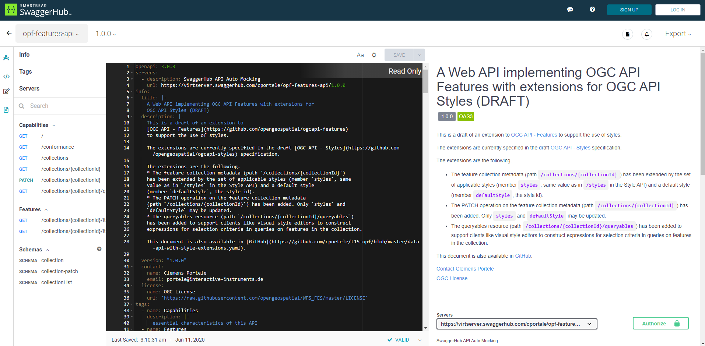
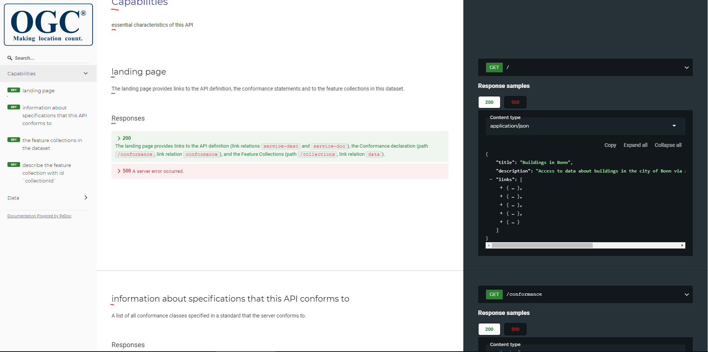
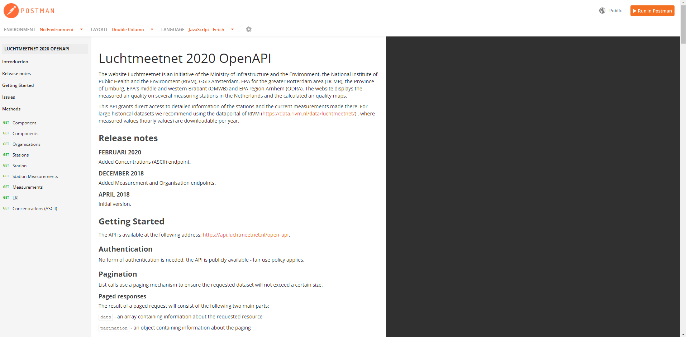
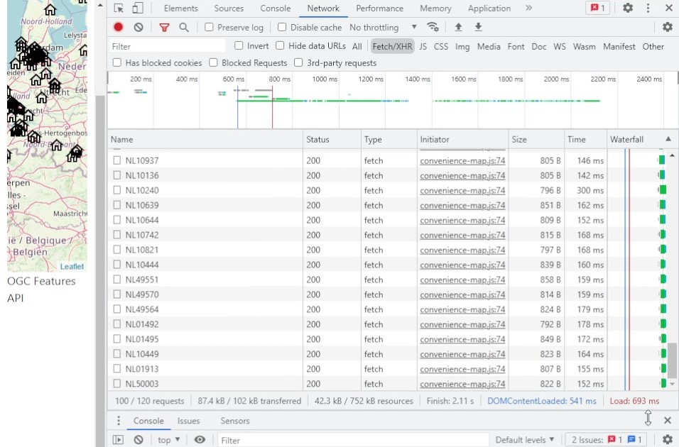
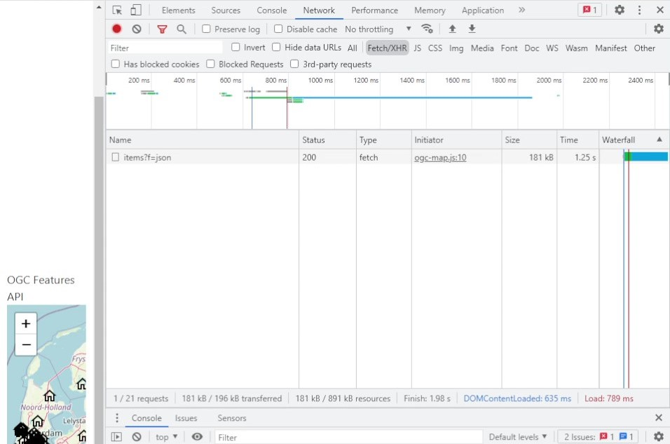
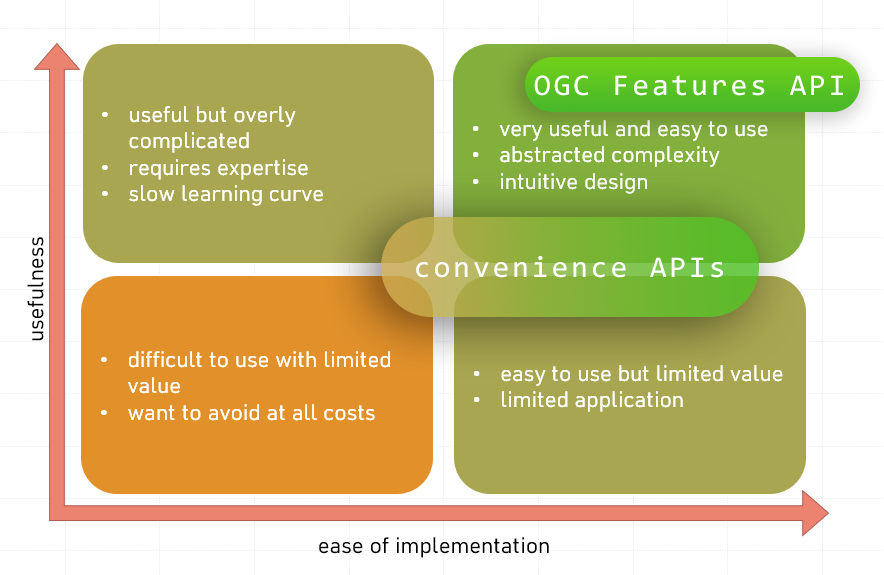

# November 4th 2021

## Standalone Convenience API Implementation

### JavaScript (source code, live demo - coming soon)

This implementation is a demo of geo-fencing. The functionality is similar to the OGC Features API implementation. The
points and time-series data for this implementation come from the [Luchtmeetnet API](https://api-docs.luchtmeetnet.nl/).

#### Advantages

- The API uses JSON, certain endpoints also use GeoJSON allowing a level of interoperability between OGC Features API.
  This enables code reusability and easy migration from an OGC Features API backend to the convenience API backend with
  minimal changes (and vise versa).

- Visualizing time-series data in the Javascript environment is made easy through multiple libraries such
  as [D3.js](https://d3js.org/) and [Chart.js](https://www.chartjs.org/). Integrating these libraries is effortless and
  documentation is easy to understand (a common trait among popular Javascript libraries).

- Similar to the OGC Features API implementation, [Proj](https://proj.org/) can be taken advantage of in converting from
  different projections. Although the API uses WGS84, the de facto standard for web maps.

- Great documentation making API endpoint testing a pleasant and effortless experience. In comparison, the documentation
  offered by OGC is messy and comes off as low effort. See
  the [documentation comparison](#documentation-comparison-and-notes)
  section below.

#### Obstacles + Areas of Improvement

- Refer to the October 7th notes for obstacles, as the same factors apply in rendering geospatial data.

- During development hot-reloading is often used by developers. When making many changes this may result in many
  reloads, overloading the server. During implementation this caused the server to go down. This can be avoided by rate
  limiting API requests.

## Web Based Implementations

These implementations both take advantage of [LeafletJS](https://leafletjs.com/), a popular open source library for web
maps. Both implementations use ES6 modules and make comparing implementations easy by comparing individual functions
themselves.

### OGC Features API (source code, live demo - coming)

In this implementation the features requested are from an OGC Features API instance. Each point returned from the API
has an associating property for a link to make another request for NO2 measurements over an interval of time. In this
way the implementation is not solely relying on OGC Features API but also a secondary API for the time series data
itself.

#### Advantages

- GeoJSON is supported out of the box in LeafletJS, allowing a web developer to simply supply the JSON data directly or
  a link pointing to the data (the /items endpoint).

- WGS84 is supported out of the box in LeafletJS, although other projections can easily be integrated using plugins such
  as [Proj4Leaflet](https://github.com/kartena/Proj4Leaflet).

- LeafletJS has a mature community, if a problem is faced it's likely there is a solution to it on websites such
  as [StackOverflow](https://stackoverflow.com/). It also allows new users to gain advanced functionality through
  plugins that are simple to integrate (i.e. time series
  data [controls](https://github.com/zimmicz/Leaflet-Timeline-Control)).

- LeafletJS has packages for many Javascript frameworks such as ReactJS, allowing web applications to take advantage of
  LeafletJS.

- Flexible and predictable number of requests through OGC Features APIs pagination capabilities.

#### Obstacles + Areas of Improvement

- Although GeoJSON is supported out of the box, OGC Features APIs are not (directly), there is no affordance to the user
  to take advantage of all the capabilities of a OGC Features API. This can easily be integrated through a plugin.

### Convenience API (source code, live demo - coming)

This implementation requests features and time series data from
the [Luchtmeetnet API](https://api-docs.luchtmeetnet.nl/). It also takes advantage of the APIs ability to provide
interpolated NO2 measurements for any given longitude and latitude simply by clicking on the map.

#### Advantages

- The API's stations endpoint conforms to GeoJSON allowing interoperability between implementations and working out of
  the box with LeafletJS. The alternative would require preprocessing of the response to either conform to GeoJSON or
  creating the Leaflet Points through Javascript.

- The API used WGS84, again allowing it to work out of the box with LeafletJS. Alternatively the Proj4Leaflet plugin
  would have been required.

- Shares the same advantages of LeafletJS's mature community as OGC Features API implementation.

#### Obstacles + Areas of Improvement

- The API was designed for a given use case in mind, the fact that it's open to the public may have been a second
  thought. This is evident based on the data returned by endpoints.

- Getting the entire collection of points requires individual requests for each station (point). This results in slower
  load time and higher bandwidth. With each request made over the network there is overhead that can be minimized
  through a more flexible API design, such as OGC Features API (for requesting station locations).
  See [load time comparison](#load-time-comparison-and-notes) section below.

- In web development hot-reloading is often used, especially by frameworks such as ReactJS. This can result in many API
  requests, again, it would be ideal to have rate limiting to prevent the server being overloaded.

### Documentation Comparison and Notes

- Below is OGC's Swagger documentation, linked from their OGC Features API webpage. The user is overloaded with
  information, creating an intimidating first impression. Not all the data is valuable and mostly redundant. Proving the
  raw documentation markdown on the documentation page itself takes away from the rendered markdown's importance, and
  simply repeats the same information in a less user-friendly format.
  

- Below is OGC's ReDoc webpage, linked from their OGC Features API webpage. Although there is no information overload,
  the content seems low effort and "thrown together". The titles of the sections are occasionally capitalized while
  other parts are lower case. It doesn't conform to a consistent design guideline. The menu on the side doesn't conform
  to the format most developers are familiar with, for example OGC's ReDoc has "`GET` the feature collections in the
  dataset" but should be "`GET` /collections" or "`GET` Collections", this "better" format is followed in the Swagger
  documentation but not the ReDoc webpage. It also raises the question of why someone would adopt the OGC Features API
  specifications when OGC themselves put little effort in documenting and presenting it (gives the impression of little
  thought put into it, regardless of whether it's true or not).
  

- Below is the convenience API's documentation. It provides concise information on using the API. There are options for
  API request examples in multiple programming languages (and even subcategories among languages), allowing beginners to
  easily make their first request in their given programming language of choice. They are also using Postman, a popular
  tool for making, documenting and most importantly testing APIs. Using modern tools like Postman allows users to easily
  import endpoints and test them in their desktop Postman application. This is an easy way of making usable and pleasant
  documentation but has the drawback of being tied to Postman's ecosystem. A custom (either through a library or from
  scratch) implementation mimicking Postman's documentation would be ideal but requires higher investment.
  See [Stripe](https://stripe.com/docs/api/payouts/create?lang=go) for an example of documentation that is similar to
  Postman (providing API request examples in multiple languages with a clean UI), through a custom solution.
  

### Load Time Comparison and Notes

- The link at the end of this paragraph is a video of a side-by-side comparison of load time between the OGC Features
  API and convenience API web based implementations. The comparison is not accounting for all factors (such as server
  location, response time, etc.) but illustrates the overhead in making several individual requests rather than a single
  larger request. The ratio between overhead and data is lower in the OGC Features API.
  [Requests video.](https://user-images.githubusercontent.com/55214462/140626143-1377b0d1-84ed-4017-bafb-b0f9ae30c966.mp4)

- Below is an image of the requests made by the convenience API implementation, it initially makes a request to get a
  list of station names, for each station a subsequent request is required to get the location data of the station. This
  results in around 100 requests made (would be even more if a limit wasn't set in the implementation).
  

- In comparison, below is an image of the requests made by the OGC Features API implementation. This instance of the API
  didn't offer pagination but the standard defined pagination allows for more refined requests by the web developer for
  a wide variety of use cases. The OGC Features API also allows the ability to request multiple items in a collection
  rather than limiting the user to a single feature per request.
  

## Overall

The comparison between OGC Features APIs and convenience APIs is difficult to do completely fairly as there is a wide
range of convenience APIs, each with their own individual advantages and obstacles. This however does illustrate one of
the largest drawbacks of convenience APis, which is the degree of inconsistencies among providers. When developing an
application that uses geospatial data it would be ideal to have reusable code on the client side (more economical and
less prone of bugs). OGC Features API enables that reusability, but convenience APIs can increase their degree of
interoperability by adhering to GeoJSON. For general use case OGC Features APIs allow predictable and flexible behavior
for a wide variety of use cases. The chart belows visually demonstrates the different sections the API categories can
fall in (not so much the degree to which they belong to the category but whether it can fall in 1 of the 4 sections of
the chart or not).

