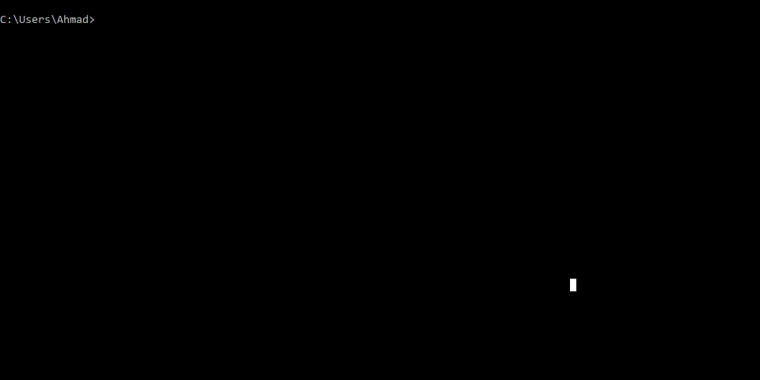
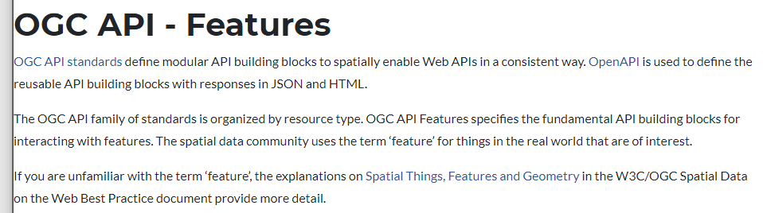

# October 7th 2021

## Standalone OGC Features Implementations

### Python (+ Jupyter) ([source code](https://github.com/ahmadayubi/features-api-implementations/tree/main/standalone/ogc/simulated-annealing))

This implementation aims to solve the Travelling Salesperson Problem on geographic points requested from an OGC Features
API compliant server. Implementation was created using Jupyter notebook (a common data science tool).

The biggest hurdles when implementing standalone solutions has to mainly do with rendering rather than
processing/analyzing. Geospatial is often visual by nature as it has to do with the real world, it's important to make
rendering that data digitally more developer friendly.

#### Advantages

- The entire codebase can be reused for any set of points from an OGC Features API compliant server. This is one of the
  biggest advantages to adhering to standards on the client side. In this implementation a developer can simply replace
  the base url of the API and the collection name, while still running through the same data analysis process without
  issues.

- The Python community surrounding geospatial data provides a great package known
  as [OWSLib](https://github.com/geopython/OWSLib), this package handles the `GET` request and parsing of the response
  JSON. By removing the need for the developer to handle 'formalities', they are then free to spend more development
  time on the application the given dataset is needed for. The package is also part
  of [OSGeo](https://www.osgeo.org/projects/owslib/), a well known foundation, allowing implementors to feel confident
  in their package choice.

  - In terms of metrics in evaluating ease of implementation, the number of lines required in combination with human
    readability is a strong indicator in ease of use. With the help of OWSLib, the number of total lines needed to
    request data from an OGC Features API compliant server can be as minimal as 3 lines (1 for importing the package, 2
    for initializing an instance and making a collection request). The following is an example of the required code:
    ```python
    from owslib.ogcapi.features import Features

    api = Features('https://apitestbed.geonovum.nl/pygeoapi')
    collection = api.collection_items('dutch_windmills')
    ```

#### Obstacles

- The biggest obstacle in standalone implementations is in regard to rendering geospatial data
  accurately. [GDAL](https://gdal.org/) is a popular library when dealing with geospatial data but in terms of
  installation and use, it is very difficult. The installation process on Windows (Microsoft Windows 10 Home & Pro)
  requires a lot of debugging and external downloads. A developer cannot simply `pip install gdal`, they must first
  download and install the GDAL library, then on a separate web page they must download the Python bindings for their
  given system. Lastly, they need to manually set environment variables. This entire process is error-prone and can be
  frustrating to debug. The error message when installing GDAL through `pip` is also intimidating and provides little
  help, see the video below as an example:

  


- When rendering features in WGS84, there are resources online that help in the process but these resources are not
  always consistent and finding the different formulas for different CRSs may be even more challenging. Some of the most
  helpful resources on the topic are also provided by organizations that offer siloed solutions (such as Google Maps
  Platform). Overall the process of implementing a custom solution for rendering is extremely error-prone and requires a
  lot of development time, and I believe the process can be simplified greatly by providing a package to handle
  rendering. Similar to how there are packages for rendering [3D objects](https://pypi.org/project/panda3d-viewer/).

- There are inconsistencies among packages on how to define a coordinate. Whether it should be (Longitude, Latitude) or
  (Latitude, Longitude). Inconsistencies like this are some of the hardest to debug as they are not issues a compiler or
  interpreter would notify the developer of. An example of this inconsistency can be seen in the
  [Geopy](https://github.com/geopy/geopy), where coordinates are defined in terms of (Latitude, Longitude), inconsistent
  with GeoJSON coordinates (from the OGC Features API compliant server) defined in terms of (Longitude, Latitude).

### JavaScript ([source code](https://github.com/ahmadayubi/features-api-implementations/tree/main/standalone/ogc/geofencing), [live demo](https://ahmadayubi.github.io/features-api-implementations/standalone/ogc/geofencing/))

This implementation is a demo of geo-fencing. The points used are provided from an OGC Features API compliant server.
The entire application can be used for many use cases ranging from tourism to audio aid for visually impaired persons.

#### Advantages

- JSON is a very lightweight and human-readable format, providing responses in JSON format not only
  makes [development easier](https://www.loc.gov/preservation/digital/formats/fdd/fdd000381.shtml) (thanks to the number
  of existing libraries for parsing JSON) but also respects the [clients bandwidth](http://www.json.org/fatfree.html).

- Converting from different projections is made 'easier' and more abstract thanks to libraries such
  as [Proj](https://proj.org/). This allows the developer not to worry as much about the complexities of projections and
  simply get the given data the way they may need. Proj4 strings are still complicated but there are many resources
  online that have an index of proj4 strings for use, such as [spatialreference.org](https://spatialreference.org/)
  which provides the proj4 string formatted already.

#### Obstacles + Areas of Improvement

- GDAL has no official bindings for JavaScript leaving cautious developers to reimplement a lot. The unofficial binding
  currently has 59 issues with the last addition to the repository being over a year ago. This lack of ongoing support
  leaves would-be implementers with a lack of confidence.

- There is no OWSlib type package/module for JavaScript. Although this is not a big issue given the 'out of box'
  compatibility JavaScript has with JSON. Making the requests manually using the Fetch API is also simple thanks to the
  intuitive hierarchy of endpoints. But having a OWSLib package would make the process even easier.

## General Notes

#### Positives

- Throughout the implementations, having the ability to develop without being coupled to API gives the developer a
  degree of freedom and confidence, knowing their code can be reused for different APIs following the same standard.
  This is also beneficial to organizations developing client implementations. Knowing that code can be reused reduces
  development time, resulting in less costs.

- The API is 'self-documenting' in terms of its intuitive design. The data returned also allows users of programs such
  as Postman or Insomnia to never have to leave the environment as the data returned also provides how to make further
  requests. See the following example response:

  ```json
  {
    "links": [
      {
        "rel": "self",
        "type": "application/json",
        "title": "This document as JSON",
        "href": "https://apitestbed.geonovum.nl/pygeoapi?f=json"
      },
      {
        "rel": "alternate",
        "type": "application/ld+json",
        "title": "This document as RDF (JSON-LD)",
        "href": "https://apitestbed.geonovum.nl/pygeoapi?f=jsonld"
      },
      {
        "rel": "alternate",
        "type": "text/html",
        "title": "This document as HTML",
        "href": "https://apitestbed.geonovum.nl/pygeoapi?f=html",
        "hreflang": "en-US"
      },
      {
        "rel": "service-desc",
        "type": "application/vnd.oai.openapi+json;version=3.0",
        "title": "The OpenAPI definition as JSON",
        "href": "https://apitestbed.geonovum.nl/pygeoapi/openapi"
      },
      {
        "rel": "service-doc",
        "type": "text/html",
        "title": "The OpenAPI definition as HTML",
        "href": "https://apitestbed.geonovum.nl/pygeoapi/openapi?f=html",
        "hreflang": "en-US"
      },
      {
        "rel": "conformance",
        "type": "application/json",
        "title": "Conformance",
        "href": "https://apitestbed.geonovum.nl/pygeoapi/conformance"
      },
      {
        "rel": "data",
        "type": "application/json",
        "title": "Collections",
        "href": "https://apitestbed.geonovum.nl/pygeoapi/collections"
      }
    ],
    "title": "GeoNovum OGC API testbed",
    "description": "An implementation showing use of pygeoapi as INSPICE download service"
  }
  ```

  If the developer wanted to view more data they can simply view the object with `"rel": "data"` and copy the `href`
  value and make a request there. They will then be provided with another response that is also 'self-documenting'. The
  following illustrates how easy the process is in tools such
  as [Insomnia (video).](https://user-images.githubusercontent.com/55214462/137027582-76e8a11f-31a3-4899-a1ba-4f0aa1b01e76.mp4)

- The standard defines the ability to use not only HTTPS but also HTTP, although this may seem insecure at first, it
  allows local development servers to run without having to deal with SSL certificates.

- `f` query parameter lets browser users quickly view the raw JSON without needing to make a curl request, for example.

- WGS84 is a good default as there are many resources available on the topic in community forums, it's also what most
  users are familiar.

#### Negatives/Areas of Potential Improvement

- The discoverability of APIs that adhere to OGC Features API is limited. This may be due to the lack of for-profit
  organizations offering APIs adhering to OGC Features API. For-profit organizations are more likely to invest greater
  in discoverability and advertising of offered APIs.

- The documentation offered by OGC on SwaggerHub is informative but users a met with a wall of ur-rendered markdown. In
  terms of documentation the raw markdown text content is not as informative as the rendered output, which is also
  provided but should be all that is shown.

- The SwaggerHub documentation is also not optimized for mobile devices and renders as the desktop webpage would, not
  fitting to the mobile form factor.

- When searching for resources related to OGC Features API, the first page of results is populated with mostly server
  side resources.

- OGC's website lacks [aesthetic and visual appeal](https://www.ncbi.nlm.nih.gov/pmc/articles/PMC4863498/) which has
  been shown to play a big role in credibility.
  - The website doesn't adhere to a design guideline, certain text is center aligned while other parts are left aligned.
  - There is a lack of margin for different resolutions, resulting in text 'hugging' the left sides of the browser.
    Shown below:
    
  - The page banners' are reused throughout the website not conforming to the web page content, they don't provide
    additional information and are likely stock images as they have been used by other unrelated websites.
  - Certain webpages are also missing `<meta>` elements that help search engines index.
  - Modern web users, especially developers, have a keen eye and have come accustomed to dynamic, visually appealing web
    pages. With OGC being the first webpage that shows up when searching for anything related to OGC Features API, it is
    important to leave a good impression on would-be implementers.

- Pagination is not well-defined and varies among implementations, for example pygeoapi uses `startindex` while others
  use `offset` query parameter.

- `bbox` query parameter is defined in terms of lower-left to top-right. This is not consistent with what english
  readers are used to, going from top-left to bottom-right. Documentation needs to make this apparent to avoid bugs in
  implementations.

- The standards document on OGC's website offer examples using the following `../collection/.../items.json`, but this
  url formatting doesn't work with pygeoapi.

## Overall

Although the columns containing negatives/obstacles seems to outweigh the positives, this is not the case. APIs adhering
to OGC Features API are easy to implement and provide confidence in implementation. Rendering in a standalone
environment has a lot of room for improvement, and needs improvement to mitigate errors and remove the need to 'reinvent
the wheel' through custom solutions, this can be done by providing better, more standard libraries focused on rendering.
Fetching and analyzing geospatial data provided through OGC Features API compliant servers is an intuitive and easy
process, from it's 'self-documenting' nature to the libraries and packages.