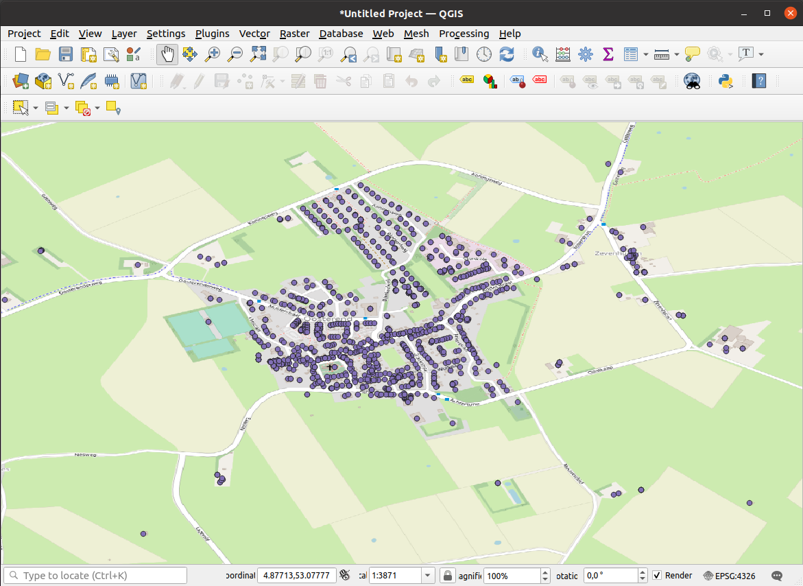

# Topic 4: Generic vs Convenience approach for Spatial data APIs

This document contains the main report for topic #4. It also contains the list of deliverables and links to the various repositories.

This topic is researched using the following projects:
- Goaf. Goaf is a Golang implementation of the OGC API Features API. This project can be found at https://github.com/PDOK/goaf
- go-ogc-api. Go-ogc-api is the Golang library that contains an implementation of the OGC API Features. It allows developers to easily build an OGC API Features enabled application. This project can be found at https://github.com/purple-polar-bear/go-ogc-api

### Summary
This topic is concerned with a comparison between a convenience API and the OGC Features API. The report takes an existing (convenience) API and investigates the costs and benefits of adding the OGC Features API to it.

The main conclusion of this report is that there are use cases where adding an OGC API implementation to an existing convenience API can provide great benefit. Important to realize is that the cost of adding an OGC API implementation is relatively low, if a library responsible for serving the API is already present. Without a library, the cost of implementing the OGC API specifications can be (too) high.

## Research question
This chapter will expand upon the research question. It will scope the research topic and it will outline the general approach. The subsequent chapters will cover the following:
- Method. Explains the research methods used, why we use them and how we use them.
- Library. The library we built. It explains the design goals and overall design.
- Results. The results of the research actions.
- Conclusions. The conclusions of the report.

### Goal
The goal of this research topic is to discover the usefulness and feasibility of the combination of an OGC API Features implementation and a convenience API. Usefulness of an API can be determined by investigating the benefits of having two API's. The feasibility can be determined by investigating the costs.

Usefulness can be determined by taking a look at the (possible) benefits of supporting both API formats. This question can be asked in a couple of different ways. There are two ways to ask this question. The first approach is to ask what the usefulness of a convenience API is, in a situation where an OGC API Features implementation already exists. The second approach is to ask what the usefulness of the OGC API Features implementation is, given an already existing convenience API.

In theory, it is almost always technically feasible to support multiple API formats. In practice however, support for multiple API's is usually limited due to costs. We will therefore have to investigate the costs of supporting multiple API formats. This requires an analysis of possible implementation methods, followed by a cost estimation of these methods. When calculating cost, both the cost of initial implementation as well as the cost of maintenance must be used in order to provide a clear picture.

### Scope

This research is limited by the following constraints:
- We will only approach the research question by taking an application with an existing (convenience) API and investigate the cost and benefit of adding an OGC API Features implementation. We acknowledge that the question can also be approached the other way (take an existing OGC API Features implementation and add a convenience API). We also acknowledge this approach as interesting. However, due to resource (time) limitations, we have chosen to only investigate the first approach.
- We make the comparison by looking at a system that contains location data, but also  measurement data. The topic is about the OGC API Features, not about OGC measurement APIs. Therefore, we will only use the location data for this topic.
- We will demonstrate the added functionality that becomes available when data is accessible using OGC API Features with only one client application (QGis). We implicitly generalize this to the functionality of other OGC compliant client applications.

### Approach
The approach to this topic is to delve into the OGC API Features and to investigate the investment and possible return of adding an OGC API Features compliant endpoint to an existing service.

To do this, we will start with an existing convenience API. This is done by taking the API from an existing open system by a Dutch organisation called 'Kadaster' that contains location data. We will investigate the full potential with a datasource containing water quality an quantity measurements for the Dutch water authorities (Rijkswaterstaat en waterschappen). For the latter, we will only take a look at the location part of their API.

Usefulness will be determined by investigating the benefits. The benefits will be determined in two ways. First, we will look into the functionality that is available if data is accessible via the OGC API Features. The convenience API is very particular and will not be understood by generic software. Practically, we will examine the data using the QGis viewer, since this viewer cannot access the data via the convenience API, but it can access the data via the OGC API Features implementation.

By demonstrating this usage, it means that adding the OGC API Features implementation unlocks the functionality of the QGis viewer. Implicitly, this means that the functionality of any OGC compliant client application (or web application) becomes available if this implementation is added.

Besides full blown applications, OGC API's can also be used easily in most popular general purpose languages. An example of such a language is Python, which is quite popular among data analysts. Python has easy to use libraries to access OGC  API's. Therefore, an additional functional benefit is easy development against the datasources.

This will allow us for some added functionality. However, more interesting than mere functionality is the question if this functionality adds any real or perceived value. This leads to the second way of determining the benefits; what is the real or perceived value of adding a OGC API Features implementation to an existing convenience API.

In order to investigate real value, an actual use case must be build and used for some time to determine actual business value. This is not feasible, given the time constraints of this research topic. We will therefore look at perceived (business) value.

Perceived value will be determined through interviewing relevant stakeholders. The answers to this interview will be summarized in this report. The report will also be presented to the stakeholder for review.

Feasibility will be determined by looking into the cost of implementing and maintaining an OGC API Features implementation. There are two strategies to implement the specification. The first one is to implement from scratch. This includes a lot of work in order to implement the specifications. The second one is to implement using an (already existing) library. We will look into both implementation strategies. However, we do consider the second strategy to be more likely in practice.

In addition, we will also determine the cost of building a library. This is relevant, as it gives us a estimate into the cost of initial adaptation for a given programming language.

## Method

Given the complexity of the research topic, we will approach the questions using a variety of different methods. The results from these methods will be combined into a single set of conclusions. The overall method is therefore a case study.

### Demonstration with QGis
The first way to demonstrate benefit is by demonstrating the datasource being accessed by an OGC client, QGis. We will not demonstrate all the capabilities of OGC clients; there are ample examples available on the Internet.

### Benefit of API - expert interview
The main question of the API interview is: is there a benefit in enriching an existing convenience API with an OGC API Features implementation?

The interview question is clear. We want to test a specific hypotheses in a qualitative way. This leads to a conclusive format. We have therefore chosen a expert interview with closed questions as the means of measuring benefit of the OGC API.

The interview will be conducted with Informatiehuis Water (IHW). They are responsible for standards in the water industry. The water industry has a convenience API known as Digitale Delta API. This makes IHW relevant and knowledgeable, and therefore a suitable candidate. We will interview John Maaskant, who is advisor on data and information management with IHW. He is also affiliated with the Dutch waterauthority (Rijkswaterstaat).

We have identified the following questions:
- Introduction. Explain the OGC standards (if required) and give a quick demo with the QGis client.
- Question #1: Does the addition of the OGC API Features implementation provide any benefit for collaboration in your industry?
- Question #2: Is it feasible to add an OGC implementation to the supported standards? This question must be approached from multiple perspectives (economical, social, organizational, cultural, etc)
- Question #3 (if applicable): Why is it not feasible?

### Determining effort cost
The total cost of adding an OGC API Features implementation consists of adding the API, the implementation cost, added with the cost of maintaining a larger codebase. We will take some industry standards to determine both the cost of implementation as well as the cost of maintenance.

Estimating cost however is not a hard science. The figures contain a margin and should give a rough idea; however, it is possible that actual costs are higher or lower, depending on many factors.

The current implementation of Goaf contains an OGC API Features implementation that is build from scratch. A new version of Goaf will be released that contains a version with a library implementation. The code required to run the new version of Goaf, the code that implements the library, can easily be identified. We will take the difference between the old version and the new version without the library implementation to determine the size of an implementation from scratch.

To determine the size of the implementation, we will take a look at the code that is required to make the Goaf project use the new library.

To determine the size of the library, we will take a look at the library directly.

When measuring the cost of implementing, we assume the implementation of the library. The library is written in Go (also refered to as Golang). Golang is a modern language developed by Google. It is a high performing language, comparable with languages such as C, C++ or Java. It may be possible that less development effort is required in languages that require less code per functionality, such as Python or Ruby.

When measuring the codebase, we measure the lines of code, without blank lines and comments. We also use the following assumptions:
- The average productivity of a full-time developer is 900 CLOC per month. This is a reasonable number for business systems.
- The total cost of one full-time developer is estimated at 10K Euro per month. This includes all cost, including management and overhead.
- In order to estimate the minimum cost, we take 2/3 of the average cost. The maximum is estimated at 3/2 of the average cost. These two give us the range of cost involved.
- We would like to remind the reader that productivity in teams can easily differ a factor of ten. This is without extremes, eg very poor performing and excellent performing teams.
- If your assumptions differ, you can also use your assumptions against the CLOC measurement.

These assumptions give us the following cost per 1000 lines of code:

| Cost without maintenance | Formula | Cost |
| -- | -- | -- |
| Average cost per KLOC | 10,000 / 0.9 | 11,111 |
| Minimum cost per KLOC | 11,111 * 66% | 7,407 |
| Maximum cost per KLOC | 11,111 * 150% | 16,667 |

With respect to maintenance, we estimate this by adding a certain factor to the original development cost. We do this with the following assumptions:
- The codebase has a life expectancy of ten years.
- The maintenance per year is around 15% of the cost of the original implementation.
- The reader can, of course, decide to use different metrics for estimating the cost of maintenance.

These assumptions give us the following cost per 1000 lines of code including maintenance:

| Cost with maintenance               | Formula       | Cost    |
| --                                  | --            | --      |
| Maintenance over 10 years           | 0.15 * 10     | 1.5     |
| Multiplication factor               | 1 + 1.5       | 2.5     |
| Average cost including maintenance  | 11,111 * 2.5  | 27,778  |
| Minimum cost including maintenance  | 7,407 * 2.5   | 18,518  |
| Maximum cost including maintenance  | 16,667 * 2.5  | 41,668  |

## Library
The library can be found at https://github.com/purple-polar-bear/go-ogc-api . It's is extracted from the OGC API Features implementation of the Goaf project. At the time of writing this report, it contains an implementation of the core part and the feature part.

### Design goals

The library is designed with the following goals in mind:
- Easy to use, especially for developers new to Geo data. The library must be easy to use for developers who 'just want to expose geodata'.
- Easy to expand. Although the library should be very easy to be used for simple use cases, it should also be suited for complex use cases. This means that the functionality of the library must be open for expansion.

Ease of use can be understood in a couple of different ways. One can look at the amount of code required for a straight forward implementation. Or, one can look at the knowledge required to implement the library. Another approach is to investigate how easy it is to debug or find bugs in an implementation. Lastly, there is the subjective experience of developers that can be taken into account.

For this report, we will look at the amount of code required to implement the library. We also ask the Kadaster team for an informal, subjective opinion. These two measurements are chosen because it is simple and viable within the context of the topic.

Ease of expansion will be understood by looking at the decoupling of certain functionality. The functional areas that are decoupled, thus easy to replace, change or expand, will be considered easy for expansion.

### Design
Usage of the library consists of two parts: initialization of the engine and implementation of a datasource. The engine is the part that takes care of all the routing, resolving the links, the templating that generates the actual output, etc. The datasource is concerned with providing collection and feature data.

Setting up the engine consists of three steps:
- The engine itself has to be setup. This provides the landingpage, conformance page and the API page.
- The Features part has to be activated. This will result in the engine responding to the collections page.
- The API has to be rebuild and the URL routing has to be setup.

The datasource consists of providing an implementation of five methods:
- Two methods concerned with collections. These are the method that will return all the collections and the method returning information about a specific collection.
- Two methods concerned with features/ items. One method will return a list of features, the other one will return a single feature.
- One method that configures the OpenAPI (Swagger) specification.

### Usage example

The following code fragment shows the minimum requirements for creating the engine and mounting it inside an existing router.

```go
func EnableOGCAPIFeatures() {
  mountingPath := "/package"  
  engine := apif.NewSimpleEngine(mountingPath)
  apif.AddBaseJSONTemplates(engine)
  apif.AddBaseHTMLTemplates(engine)

  featuredatasource := myDatasourceImplementation.NewImplementation()
  apif.EnableFeatures(engine, featuredatasource)
  apif.AddFeaturesJSONTemplates(engine)
  apif.AddFeaturesHTMLTemplates(engine)

  engine.RebuildOpenAPI()
  router.HandleFunc(regexp.MustCompile("^"+mountingPath), engine.HTTPHandler)
}
```

In order to provide a datasource implementation for features, the following methods must be implemented:

```go
type FeatureService interface {
  Collections() []featuremodels.Collection
  Collection(string) featuremodels.Collection
  Features(*http.Request, *featuremodels.FeaturesParams) featuremodels.Features
  Feature(string, string) *featuremodels.Feature
  BuildOpenAPISpecification(builder coreservices.OpenAPIBuilder)
}
```

The readme of the library contains a code fragment that implements the datasource. The readme can be found at https://github.com/purple-polar-bear/go-ogc-api

## Results
This chapter contains the results from our research.

### Library
Before we dive into the benefits and the cost of an additional OGC API Features implementation, we will look into the results of the library development.

#### Code review on library

The design of the library as well as the implementation have been submitted to the project owners of Goaf (a team of Kadaster). They were asked to criticize the design. They find the implementation, at face value, sufficient for further exploration. They want to use this library for a different project. The have also stated that a conclusion cannot be drawn without actual using the code in a different project.

#### Ease of expansion

With respect to ease of expansion, there is decoupling in the following functional areas:
- The 'Features' part is independent from the main engine. This means one doesn't have to use/ load the features part, but can use instead other OGC API Features, such as the tileset. This leads to ease of expansion with respect to the OGC API standards.
- The library contains default json and html templates. However, these templates can be replaced by other json or html templates. This leads to ease of expansion with respect to the (most) common templates.
- A developer can easily add other template formats, such as Geopackage. This can be done by simple adding other templates to a service. This leads to ease of expansion with respect to output formats.

#### Subjective experience of library development
When implementing the specifications in the library, the developers had the following experience:
- Experience in working with Geodata, including implementing the OGC WFS 2.0 standard.

The developers had the following subjective observations:
- Implementing the collections and features part is straightforward and can be done relatively easily.
- Implementing the linking part of the library is tricky; the library must have knowledge about the paths at which it is served in order to create the links.
- The HTML implementation is only relevant for services that are open to the public or that must serve the data in HTML format. If a non-open service is build that is only used by GIS clients (such as QGis), the HTML templates don't have any value.
- The OpenAPI specification is a lot of work to implement. We also see little added value, given that GIS clients natively understand the API specification; they don't need the OpenAPI part to understand the API itself.

#### Subjective comparison with WFS2 standard
We found the following differences in implementation with respect to the WFS2.0 standard:
- The OGC API Features uses links to the next page when serving features. We did not find this easy to use; using links means you have to reproduce the URL that was requesting the page which is more complex to do than adding a boolean indicating a next page, or implicitly signaling that a next page exists if you return the maximum requested items. The WFS20 implementation also uses links, but primarily during the GetCapabilities function. To add links to all the pages make a (fast) implementation more difficult. Under the assumption of not using any advanced features (such as queries), we find the WFS2.0 implementation easier.
- The OpenAPI specification is not necessary if you know you are dealing with an specific standard. You can find all the collections from the landingpage. From the collection, you can find all the items/ features. The OpenAPI specification is mandatory for OGC API Features, WFS2.0 does not have them. We therefore find the WFS2.0 implementation to be easier.

#### Known issues
During the development of the library we encountered the following bugs:
- The OpenAPI specification does not pass the OGC Teamengine test suite.

The library was rated against the OGC Teamengine testsuite. We encountered the following issues with the OGC Teamengine testsuite:
- The response messages are cryptic. They do not clearly indicate what the problem is. For example, one of our message was 'cannot find /conformance'. However, upon manual inspection, the path does work, it does resolve and it returns the correct data.
- Because of the cryptic feedback messages, we looked into the templates (CTL's) that are generating them. However, we could not find the underlying CTL's. This made further debugging of the problem sufficiently high to not possible.
- This led working with Teamengine to be cumbersome and frustrating. This can be seen as a problem, as it hinders adaptability.
- There are many references to OGC API libraries. Currently, the go-ogc-api is not present on any of the lists. Adding these references will increase visibility of the library, thus improving adaptability.

### Benefits - QGis viewer

Below is an image of QGis with the datasource loaded as OGC API Feature set using the library:



You can clearly see that the datasource is now available inside a Gis client.

### Benefits - Expert interview

John Maaskant from IHW has participated in the interview and we asked him the questions from the interview design:
- Question #1: Does the addition of the OGC API Features implementation provide any benefit for collaboration in your industry?
- Question #2: Is it feasible to add an OGC implementation to the supported standards? This question must be approached from multiple perspectives (economical, social, organizational, cultural, etc)
- Question #3 (if applicable): Why is it not feasible?


His response was as follows:
> The addition of the new OGC API standards can deliver a lot of value for the water sector. It allows GIS software to connect to datasources in water sector. This will vastly open up the industry to all sorts of innovation. This innovation can come from the functionality of existing GIS software as well as new software that is OGC compliant. Also, the addition of an OGC API implementation can suppress or prevent vendor lock-in positions.
>
> In order for this to work though, the OGC API Features is not sufficient. An OGC API standard for timeseries is also required, given that the data is about time based measurements.
>
> Economically, an implementation must be done in a way that minimal investment is required. There are initiatives that allow us to expose the DD-API easily using very little investment in software. IHW uses a FAIR connector for connectivity with and between the industry. This allows to change only one system in order to enable the OGC API for the entire industry. This path, or a comparable one, must be taken, otherwise many software systems must be adapted, which is costly.
>
> Socially and organizationally, it takes time to implement the OGC API specifications alongside the DD-API, given that many organizations have done extensive investments into the DD-API and may view the OGC API as a competitor instead of an addition.
>
> Culturally, we would to stress that the governmental culture in the Netherlands is decentralized (or federated). Although IHW is the (legally) formal owner of the specifications, it cannot dictate changes to the participants in the industry. Compliance and cooperation must be achieved through extensive collaboration (so called 'polderen'). As such, implementation must be done at a small scale and then be expanded. Use updates and development of new systems as opportunities to implement the OGC standard.


### Cost

#### Code size & cost estimate

| Measurement                   | CLOC size |
| --                            | --   |
| Original Goaf project         | 2570 |
| Goaf without implementation   | 1370 |
| Code required to run library  |  191 |
| Library                       | 1631 |

From the measurements, we can conclude the codesize of the implementation from scratch to be the difference between the original Goaf project and the Goaf project without the implementation: 2570 - 1370 = 1200. The 'Goaf without implementation' was taken approximately; it was too cumbersome to completely remove all code references and refactorings for a Goaf implementation without any traces of internal serving the specifications.

This leads to the following cost estimates. Keep in mind that all the implementations are given with maintenance:

| Component                   | Development cost | Total cost      |
| --                          | --               | --              |
| Library                     |  12.000 - 27.000 | 30.000 - 68.000 |
| Implementation from scratch |   9.000 - 20.000 | 22.000 - 50.000 |
| Using library               |    1.400 - 3.200 |  3.500 - 8.000  |

As a note, if a library is used by multiple parties, the cost of maintenance can be split by these parties. This means that multiple people contribute to the library.

## Conclusion
This leads to the following conclusions:
- Implementing the library is quite straightforward and can be done with minimal cost. It is an affordable and easy to use option for many developers.
- There is high value in offering OGC API implementations besides a convenience API. In the use case we have interviewed, the availability of a time series API is mandatory in order for the OGC API implementation to be useful. However, with a time series API, the value is considered very high.
- OGC API Features is already supported by major Gis clients (such as QGis). Any server that offers OGC API Features can therefore offer the functionality of such tools to their clients immediately.
- Building an OGC API Features implementation from scratch is relatively expensive and requires in depth knowledge of the specifications.
- Because of the low cost of implementing the library, the OGC API Features is easily adopted as an additional API system.
- OGC Teamengine is not a very user friendly system. This hinders compliancy and raises the bar for adaptation.
